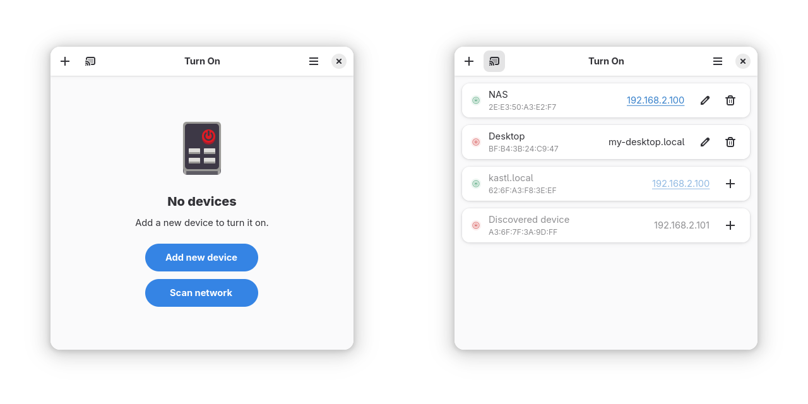

# Turn On

[](https://translate.codeberg.org/engage/de-swsnr-turnon/)

Turn on devices in your network on GNOME:



A small GNOME utility application to send Wake On LAN (WoL) magic packets to devices in a network.

## Installation

- [Flathub](https://flathub.org/apps/de.swsnr.turnon)

## Translations

Please submit translations to <https://translate.codeberg.org/engage/de-swsnr-turnon/>.

## Troubleshooting

You can obtain a debugging log by running Turn On as follows from a terminal:

```console
$ flatpak run --env=G_MESSAGES_DEBUG=all de.swsnr.turnon
```

You may want to add this to your bug reports, but note that it may contain **sensitive information**.
Read them carefully before sharing them publicly; in doubt, ask to share them privately in your bug report.

## License

Copyright Sebastian Wiesner <sebastian@swsnr.de>

Licensed under the EUPL, see <https://interoperable-europe.ec.europa.eu/collection/eupl/eupl-text-eupl-12>
