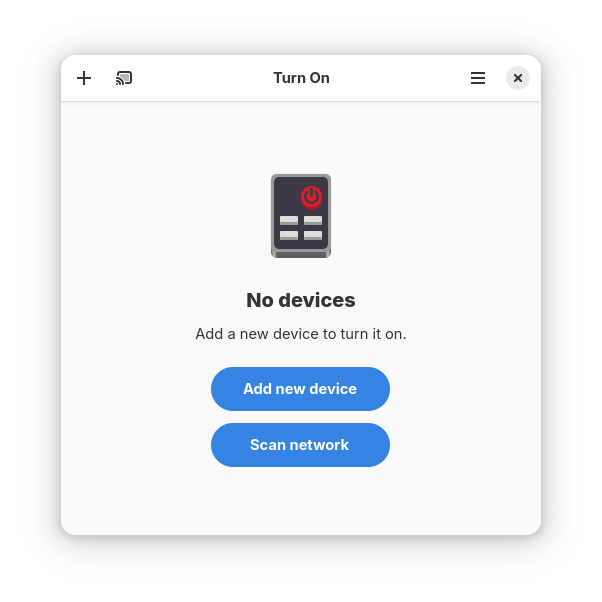
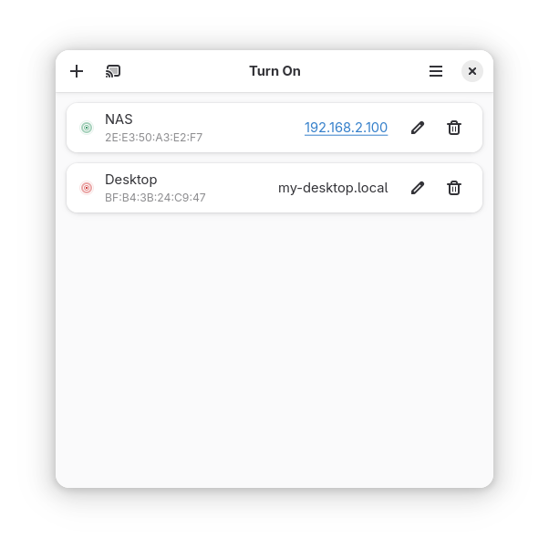

# Turn On

[](https://github.com/swsnr/turnon/releases/)
[](https://flathub.org/apps/de.swsnr.turnon)
[](https://translate.codeberg.org/engage/de-swsnr-turnon/)
[](https://github.com/swsnr/turnon/actions)
[](https://build.opensuse.org/package/show/home:swsnr:turnon/turnon)

Turn on devices in your network on GNOME:





A small GNOME utility application to send Wake On LAN (WoL) magic packets to devices in a network.

## Installation

- [Flathub](https://flathub.org/apps/de.swsnr.turnon)
- [Arch binary package](https://build.opensuse.org/project/show/home:swsnr:turnon).

## Translations

Please submit translations to <https://translate.codeberg.org/engage/de-swsnr-turnon/>.

## Troubleshooting

Obtain a debugging log with:

```console
$ flatpak run --env=G_MESSAGES_DEBUG=all de.swsnr.turnon
```

You may want to add this to bug reports.

## License

This Program is subject to the terms of the Mozilla Public License, v. 2.0. If a copy of the MPL was not distributed with this file, You can obtain one at <http://mozilla.org/MPL/2.0/>.
